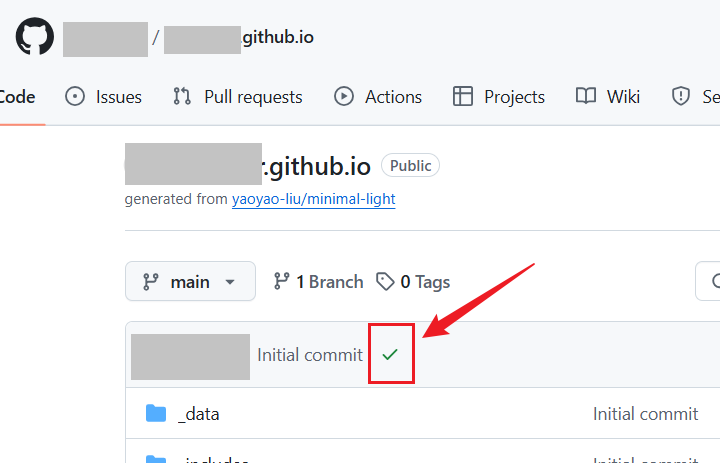

# 零基础使用 [minimal-light](https://github.com/yaoyao-liu/minimal-light) 半小时搭建学术主页

## 1 初始部署

fork [minimal-light](https://github.com/yaoyao-liu/minimal-light) 仓库(或者直接使用 [minimal-light](https://github.com/yaoyao-liu/minimal-light) 为模板，点击 'star' 右边的 'Use this template' 即可)，给该仓库命名为`your-github-username.github.io`。稍等一会，如图 1 所示，出现绿色 √ 说明部署完毕，访问`your-github-username.github.io`，即可出现和模板 [demo site](https://minimal-light-theme.yliu.me/) 一致的网页，说明已经部署成功了，后续在此基础上修改即可。



## 2 必要修改

### 2.1 编辑 `_config.yml`（网页左侧栏的内容）

以在`_config.yml`文件中修改以下变量，即可配置个人基本信息:

  ```yaml
# 基本信息
title: 姓名
position: 当前状态，例如 Ph.D. Student
affiliation: 所在单位
email: example (at) example.edu

# 搜索引擎优化 (SEO)
keywords: minimal light # 可以不修改
description: "your name's academic website" 
canonical: https://minimal-light-theme.yliu.me/ # 可以不修改

# 链接（不需要的注释掉）
google_scholar: https://scholar.google.com/
cv_link: files/Curriculum_Vitae.pdf # 需要将 CV 放置在 `assets/files/Curriculum_Vitae.pdf`
github_link: https://github.com/
#linkedin: https://www.linkedin.com/
#twitter: https://twitter.com/

# 图片路径
avatar: ./assets/img/avatar.png   # 左侧栏位置的头像，改成个人照片
favicon: ./assets/img/favicon.png  # 网站图标，可以不修改
favicon_dark: ./assets/img/favicon-dark.png  # 黑暗模式下的网站图标，可以不修改
  ```

### 2.2 编辑 `index.md`（网页右侧的主内容）

修改根目录下的`index.md` 的内容即可。

`About Me`

`Research Interests`

`News`

`Contact`

上面几个部分，遵循 [Markdown](https://www.markdownguide.org/basic-syntax/) 基本语法进行修改即可；如果不需要某一部分，直接删除即可。

`Publication`

`Service`

这两部分有点特殊，作者使用了 Jekyll 中的指令 ``，将 `_includes/publications.md` 和 `_includes/services.md` 插入到了 `index.md` 文件中。具体为：

``

``

因此，接下来，分别打开两个文件：

#### `_includes/publications.md`

该文件使用了 Jekyll 的 Liquid 模板语言，引用 `_data/publications.yml` 生成列表内容，并通过内联 CSS 样式进行了一些样式上的调整。看起来包含的内容很多，其实只需要对第一行的内容进行修改：

```html
<h2 id="publications" style="margin: 2px 0px -15px;">Selected Publications <temp style="font-size:15px;">[</temp><a href="https://scholar.google.com/" target="_blank" style="font-size:15px;">Google Scholar</a><temp style="font-size:15px;">]</temp><temp style="font-size:15px;">[</temp><a href="https://orcid.org" target="_blank" style="font-size:15px;">ORCID</a><temp style="font-size:15px;">]</temp><temp style="font-size:15px;">[</temp><a href="https://scholar.google.com/" target="_blank" style="font-size:15px;">Research Gate</a><temp style="font-size:15px;">]</temp></h2>
```

- `<h2>` 标记定义了一个二级标题，“Selected Publications”（也可以根据需求修改为 Publications）。
-  `<a>` 标签提供了三个链接：Google Scholar、ORCID 和 Research Gate。如果不需要某一项，直接删除；或者需要更多，直接复制修改即可。

##### `_data/publications.yml`

前面提到，`_includes/publications.md` 引用了 `_data/publications.yml` 来生成列表内容，因此如果要删减修改 publications，需要打开 `_data/publications.yml`。接下来，结合 `_includes/publications.md` 的内容，同时参考示例直接修改 `_data/publications.yml` 即可。

```yaml
title: 文章标题【必填】
author: 作者，使用该标签 <strong>your name</strong> 来凸显自己的名字【必填】
conference_short: 期刊缩写（其实可以任何东西，也可以填写期刊全称），最终它会显示在文章图片的左上角【必填】
conference: 期刊全称，发表年份【必填】
pdf: 文章 pdf 链接，如果是外部链接，直接放置链接即可，例如 www.google.com；如果是本地文件，例如名称为 `article.pdf`，可以将该 pdf 放在 `assets/files` 内（放在 `assets` 内的其他文件夹也可以），然后这里填写 /assets/files/article.pdf【选填】
code: 文章 code 链接【选填】
page: 文章如果有单独的介绍主页等，也可以放在这里【选填】
bibtex: 文章 bibtex【选填】
notes: 文章类型，例如 Oral Presentation, Research Article, Conference Article 等等根据实际填写【选填】
image: 文章代表图片，如果图片名称为 'teaser_example_2.png'，同时其放置在了 `assets/img` 内，那么这里填写 './assets/img/teaser_example_2.png' 即可【选填】
others: 可以在这里写任何东西，例如文章的简介【选填】
```

#### `_includes/services.md`

打开之后，根据需要修改即可，如果不需要该部分可以直接把 `index.md` 内的 `` 这句删除（或者直接把 `_includes/services.md` 里面的内容删除）。


---

完成上述内容已经足够了，下面是进阶内容，主要是针对页面的布局、细节样式等进行修改。

## 3 进阶修改

根据需求对这些文件修改

`/_layouts/homepage.html`

`/_sass/minimal-light.scss`

`/_sass/minimal-light-no-dark-mode.scss`

`/assets/css/...`

当前分支的修改：

- 添加了 back to top：[add vanilla-back-to-top function](https://github.com/HaiyanKong/minimal-light/commit/8b1f018a367f4c552a5863147d91ee65d32f7a73)
